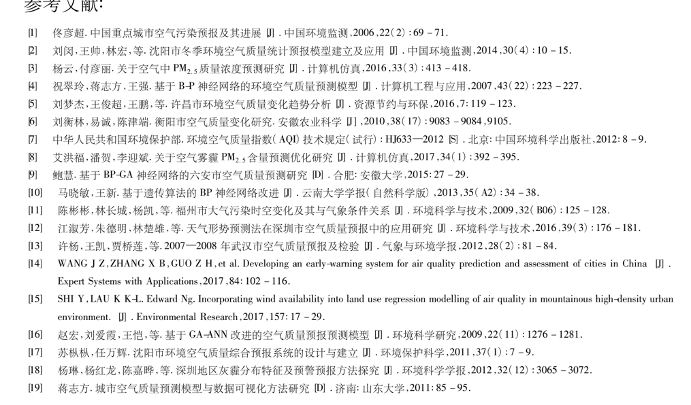

# Lanzhou-Air-Quality-Forecast-Algorithm
算法仓库去作为小论文的代码
## 科研问题
1.常规监测项审核值十四五-(实况) 气象参数原始值(实况) 有什么区别？

### 研究目标
### 研究内容
### 研究日记
1. ✅兰州市空气质量检测站点的地点分布图
2. 期刊的模版下载下来
3. 找参考文献原文 找到一篇有价值的论文（你要投稿的期刊类似的期刊的级别的做这个方面的研究），进行论文精读
4. 挂点基金会好投一点，大胆问一下你的老师有什么基金，可以给你挂着的。
### 拟采取的研究方法

### 技术路线

### 实验方案及可行性分析

### 预期的研究进展
1. 
### 可能的引用

#### 怎么画地图

1.https://www.bilibili.com/video/BV1vS4y1m782?spm_id_from=333.337.search-card.all.click
2.或者用arcgis
